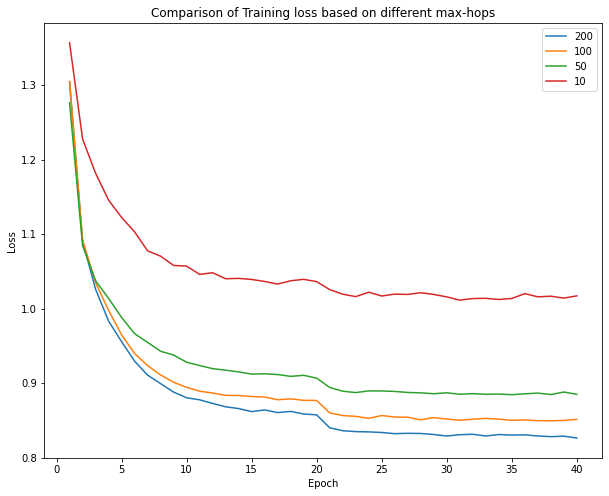

# Graph Recommender Systems
The focus of the project is to implement and compare the traditional Matrix Factorization (numerical linear algebra) approach and IGMC (SOTA) approach across various metrics.
**Matrix Factorization**
The code for the matrix factorization is available under the folder MF. It is a jupyter notebook with instructions/comments to run added towards every step.

**IGMC**
The code for the IGMC model is available under the folder IGMC.
The commands used to run the train and test the model is given below

```python
  from Main import train
  Params = {'Epochs':40, 'Batch_Size':50, 'LR': 1e-3, 'LR_Decay_Step' : 20, 'LR_Decay_Value' : 10, 'Max_Nodes_Per_Hop':200}
  losses, model, test_loader, test_ratings = train(params = Params)
  test(model, test_loader, test_ratings, topK=10)
```
The description of various hyper-parameters is given below.

* Epochs - The number of iterations a model is set to train
* Batch_Size - size of the mini batch used to split the dataset (train/test)
* LR - Learning rate of the model
* LR_Decay_Step - Epoch at which learning rate will be reduced
* LR_Decay_Value - The amount by which learning rate will be reduced 
* Max_Nodes_Per_Hop - Maximum number of hops considered in extracting sub graphs

The Hyperparameter testing on Max_Nodes_Per_Hop has been performed by keeping values of others as constant.
Below is the graph depicting the relation of training loss across various Max_Nodes_Per_Hop configurations.



It can be seen that as the maximum nodes increase, loss values tends to decrease for a specific number of epochs.

The comparison of various metrics over the test set on different max_nodes_per_hop is given in the below table.

| Metric        | 10-Nodes     | 50-Nodes |  100-Nodes |  200-Nodes | 
|--------------|-----------|------------|------------|------------|
| MSE | 1.032 | 0.8701 | 0.8492 | 0.8371 |
| Precision@10 | 0.5578 | 0.6521 | 0.6655 | 0.7095 |
| Recall@10 | 0.3876 | 0.4435 | 0.4219 | 0.4446 |
| F1 Score | 0.4762 | 0.5279 | 0.5164 | 0.5466 |
| Time per Epoch | 50 sec | 90 sec | 125 sec | 200 sec |

**Matrix Factorization vs IGMC Results**

|         | MSE     | Precision@10 |  Recall@10 | F1 Score | Time Per Epoch | 
|--------------|-----------|------------|------------|------------| ------------|
| MF |  0.9045 | 0.55 | 0.47 | 0.4902 | 5 sec | 
| IGMC |  0.8371 | 0.7095 | 0.4446 | 0.5466 | 200 sec |

